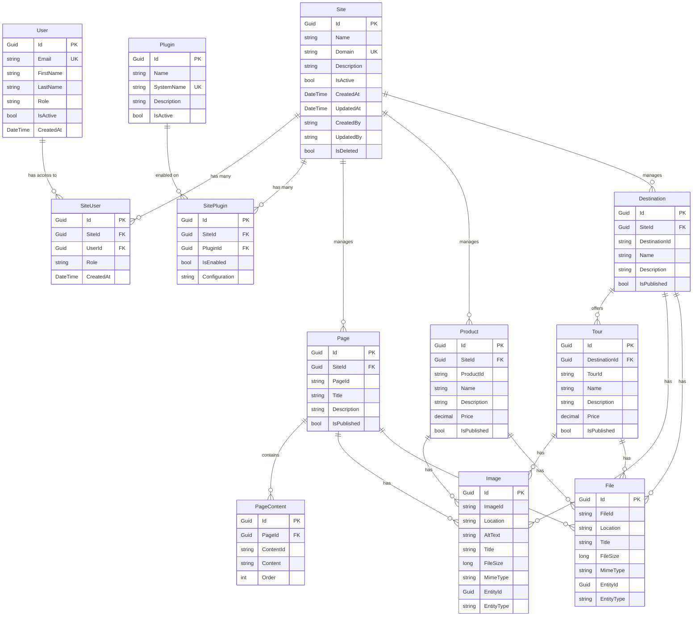
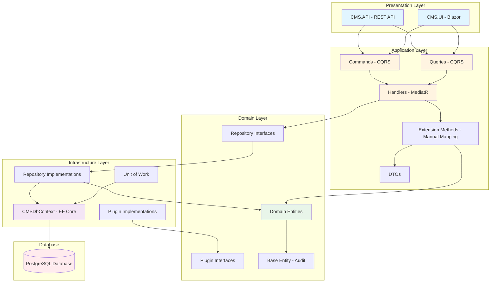
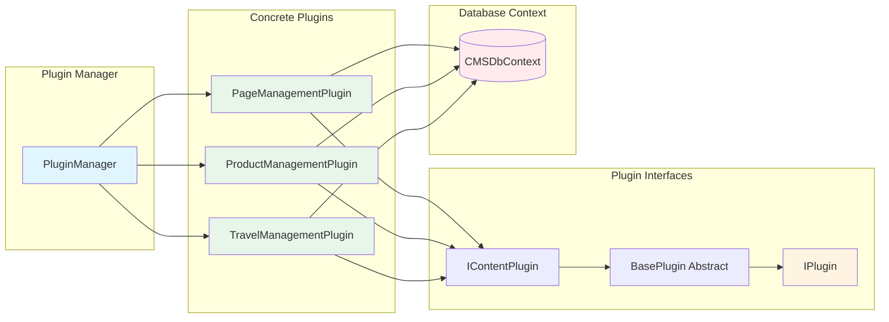
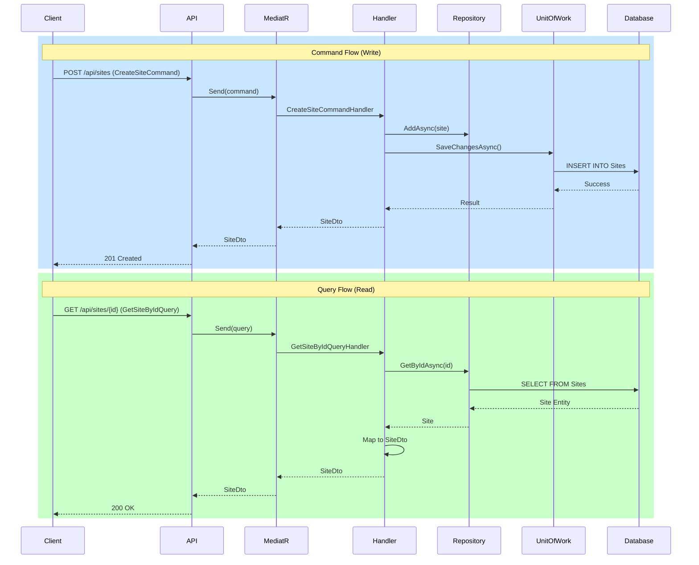
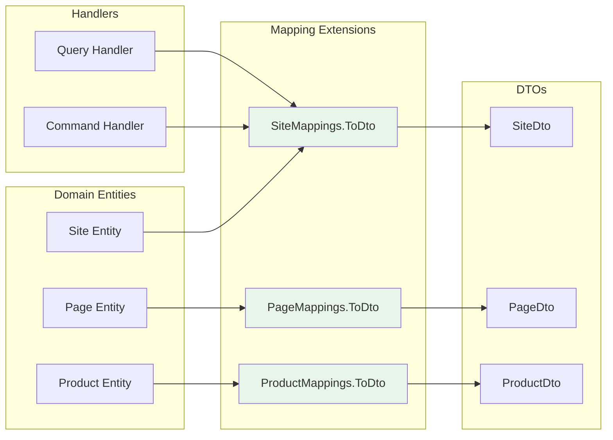
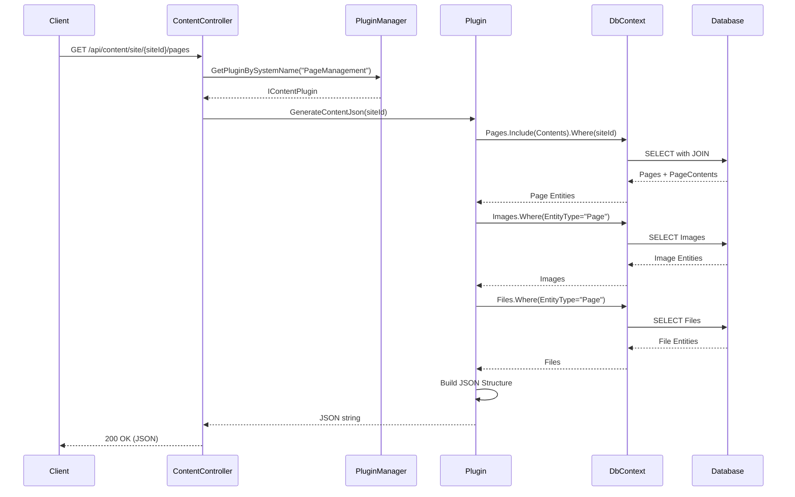
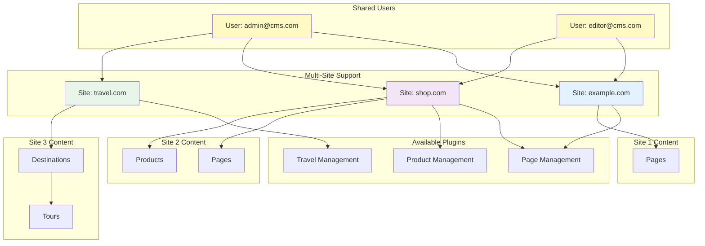

# CMS Domain Design Overview

## Entity Relationship Diagram



---

## Architecture Layers



---

## Plugin System Architecture



---

## CQRS Flow



---

## Manual Mapping Architecture

The CMS uses **manual mapping with extension methods** instead of AutoMapper for better performance and maintainability.



### Mapping Benefits

| Aspect | Manual Mapping | AutoMapper |
|--------|---------------|------------|
| **Performance** | ✅ No reflection overhead | ❌ Uses reflection |
| **Compile-time safety** | ✅ Type-checked | ⚠️ Runtime errors possible |
| **Debugging** | ✅ Easy to trace | ❌ Complex stack traces |
| **Dependencies** | ✅ Zero dependencies | ❌ Package dependency |
| **Licensing** | ✅ No licensing costs | ⚠️ Commercial license required (v15+) |
| **Maintenance** | ✅ Explicit and clear | ⚠️ Magic conventions |

### Example Usage

```csharp
// Extension method in CMS.Application/Mappings/SiteMappings.cs
public static SiteDto ToDto(this Site site)
{
    return new SiteDto
    {
        Id = site.Id,
        Name = site.Name,
        Domain = site.Domain,
        Description = site.Description,
        IsActive = site.IsActive
    };
}

// Usage in handler
public async Task<SiteDto?> Handle(GetSiteByIdQuery request, CancellationToken cancellationToken)
{
    var site = await _siteRepository.GetByIdAsync(request.SiteId);
    return site?.ToDto(); // Clean, explicit mapping
}
```

---

## Content Export Flow



---

## Multi-Tenancy Model



---

## Entity Inheritance Structure

```mermaid
classDiagram
    class BaseEntity {
        <<abstract>>
        +Guid Id
        +DateTime CreatedAt
        +DateTime? UpdatedAt
        +string? CreatedBy
        +string? UpdatedBy
        +bool IsDeleted
    }

    class Site {
        +string Name
        +string Domain
        +string? Description
        +bool IsActive
        +ICollection~SiteUser~ SiteUsers
        +ICollection~SitePlugin~ SitePlugins
    }

    class User {
        +string Email
        +string FirstName
        +string LastName
        +string Role
        +bool IsActive
        +ICollection~SiteUser~ SiteUsers
    }

    class Page {
        +Guid SiteId
        +string PageId
        +string Title
        +string? Description
        +bool IsPublished
        +Site Site
        +ICollection~PageContent~ Contents
    }

    class PageContent {
        +Guid PageId
        +string ContentId
        +string Content
        +int Order
        +Page Page
    }

    class Product {
        +Guid SiteId
        +string ProductId
        +string Name
        +string? Description
        +decimal Price
        +bool IsPublished
        +Site Site
    }

    class Destination {
        +Guid SiteId
        +string DestinationId
        +string Name
        +string? Description
        +bool IsPublished
        +Site Site
        +ICollection~Tour~ Tours
    }

    class Tour {
        +Guid DestinationId
        +string TourId
        +string Name
        +string? Description
        +decimal Price
        +bool IsPublished
        +Destination Destination
    }

    class Plugin {
        +string Name
        +string SystemName
        +string? Description
        +bool IsActive
        +ICollection~SitePlugin~ SitePlugins
    }

    class SiteUser {
        +Guid SiteId
        +Guid UserId
        +string Role
        +Site Site
        +User User
    }

    class SitePlugin {
        +Guid SiteId
        +Guid PluginId
        +bool IsEnabled
        +string? Configuration
        +Site Site
        +Plugin Plugin
    }

    class Image {
        +string ImageId
        +string Location
        +string? AltText
        +string? Title
        +long FileSize
        +string? MimeType
        +Guid EntityId
        +string EntityType
    }

    class File {
        +string FileId
        +string Location
        +string? Title
        +long FileSize
        +string? MimeType
        +Guid EntityId
        +string EntityType
    }

    BaseEntity <|-- Site
    BaseEntity <|-- User
    BaseEntity <|-- Plugin
    BaseEntity <|-- Page
    BaseEntity <|-- PageContent
    BaseEntity <|-- Product
    BaseEntity <|-- Destination
    BaseEntity <|-- Tour
    BaseEntity <|-- SiteUser
    BaseEntity <|-- SitePlugin
    BaseEntity <|-- Image
    BaseEntity <|-- File
```



---

## Key Design Patterns

### 1. **Repository Pattern**
- Abstracts data access logic
- `IRepository<T>` generic interface
- Specific repositories: `ISiteRepository`, `IUserRepository`, etc.

### 2. **Unit of Work Pattern**
- Manages transactions across multiple repositories
- Ensures atomic operations
- `IUnitOfWork` interface with `SaveChangesAsync()`

### 3. **CQRS (Command Query Responsibility Segregation)**
- **Commands**: Modify state (CreateSiteCommand)
- **Queries**: Read state (GetAllSitesQuery, GetSiteByIdQuery)
- Handled by MediatR

### 4. **Plugin Pattern**
- Extensible plugin system
- `IPlugin` → `IContentPlugin` → `BasePlugin`
- Concrete implementations: Page, Product, Travel plugins
- Managed by `PluginManager`

### 5. **Clean Architecture**
- **Domain**: Entities, interfaces (no dependencies)
- **Application**: Business logic, CQRS handlers (depends on Domain)
- **Infrastructure**: Data access, EF Core (depends on Domain)
- **Presentation**: API, UI (depends on Application)

### 6. **Soft Delete Pattern**
- `IsDeleted` flag on `BaseEntity`
- Data never physically removed
- Audit trail preserved

### 7. **Audit Pattern**
- Automatic tracking via `BaseEntity`
- `CreatedAt`, `CreatedBy`, `UpdatedAt`, `UpdatedBy`
- Timestamps in UTC

### 8. **Multi-Tenancy Pattern**
- Site-based isolation
- Shared user pool across sites
- `SiteUser` junction table with roles
- Content scoped by `SiteId`

---

## Domain Rules & Constraints

### Unique Constraints
- `Site.Domain` - Each site must have unique domain
- `User.Email` - Each user must have unique email
- `Plugin.SystemName` - Each plugin must have unique system name

### Required Fields
- All entities require `Id` (Guid)
- All entities require `CreatedAt` (DateTime)
- Site requires `Name` and `Domain`
- User requires `Email`, `FirstName`, `LastName`, `Role`

### Business Rules
1. **Site Activation**: Sites can be activated/deactivated via `IsActive`
2. **Publishing**: Pages, Products, Destinations, Tours have `IsPublished` flag
3. **Ordering**: PageContent has `Order` field for sequencing
4. **Pricing**: Product and Tour use `decimal(18,2)` for price precision
5. **Media Polymorphism**: Images and Files use `EntityType` + `EntityId` for flexible associations
6. **Role-Based Access**: Users have different roles per site via `SiteUser.Role`
7. **Plugin Enablement**: Plugins can be enabled per site with custom configuration

---

## Database Indexes

Based on query patterns, the following indexes are recommended:

```sql
-- Primary Keys (automatic)
PK on all Id columns

-- Unique Indexes
UNIQUE INDEX on Sites.Domain
UNIQUE INDEX on Users.Email
UNIQUE INDEX on Plugins.SystemName

-- Foreign Key Indexes (automatic in most cases)
INDEX on SiteUsers.SiteId
INDEX on SiteUsers.UserId
INDEX on SitePlugins.SiteId
INDEX on SitePlugins.PluginId
INDEX on Pages.SiteId
INDEX on PageContents.PageId
INDEX on Products.SiteId
INDEX on Destinations.SiteId
INDEX on Tours.DestinationId

-- Query Optimization Indexes
INDEX on Images(EntityType, EntityId)
INDEX on Files(EntityType, EntityId)
INDEX on Pages(SiteId, IsPublished)
INDEX on Products(SiteId, IsPublished)
INDEX on Destinations(SiteId, IsPublished)
```

---

## Scalability Considerations

### Horizontal Scaling
- API layer is stateless (can run multiple instances)
- PostgreSQL read replicas for query scaling
- Redis caching for frequently accessed data

### Vertical Scaling
- Database connection pooling configured in `appsettings.json`
- Async operations throughout (async/await pattern)
- EF Core query optimization with `.AsNoTracking()` for read-only queries

### Content Delivery
- Static files (Images, Files) should be served from CDN
- JSON export cached with expiration policy
- Consider adding `ETag` headers for cache validation

### Multi-Tenancy at Scale
- Site-based data partitioning
- Separate database per site (future enhancement)
- Shared infrastructure with resource quotas

---

## Future Enhancements

1. **Versioning**: Page/Product version history
2. **Workflow**: Content approval workflow
3. **Localization**: Multi-language support per site
4. **Search**: Full-text search with Elasticsearch
5. **Analytics**: Track page views, product views
6. **Media Processing**: Image resizing, format conversion
7. **Webhooks**: Notify external systems on content changes
8. **GraphQL**: Alternative API layer
9. **Event Sourcing**: Audit log of all changes
10. **Real-time**: SignalR for live content updates

---

## Technology Stack Summary

| Layer | Technology | Purpose |
|-------|-----------|---------|
| **Domain** | C# Records/Classes | Pure business entities |
| **Application** | MediatR | CQRS implementation |
| **Application** | Extension Methods | Manual DTO mapping (no AutoMapper) |
| **Infrastructure** | EF Core 8 | ORM |
| **Infrastructure** | Npgsql | PostgreSQL provider |
| **Database** | PostgreSQL 16 | Relational database |
| **API** | ASP.NET Core 8 | REST API |
| **Authentication** | ASP.NET Identity + JWT | User authentication |
| **UI** | Blazor Server | Admin interface |
| **Containerization** | Docker | Deployment |
| **Testing** | xUnit + Testcontainers | Unit & integration tests |

